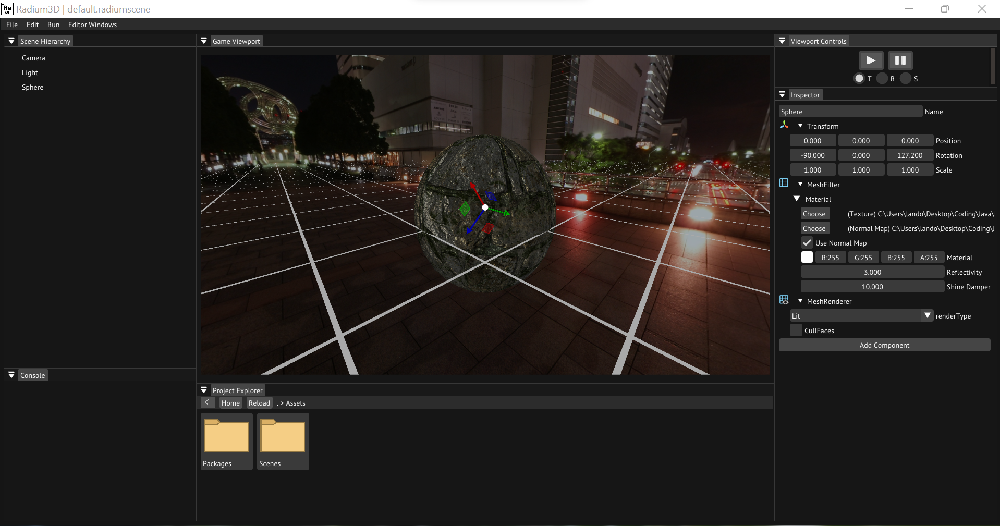

    

    
    
    
    

## Installation

- To build and run the editor, download the latest release from the [Releases](https://github.com/radiumgame/radium/releases/latest) section of the repository.
- Next clone the [Sample Project](https://github.com/radiumgame/sample-project)
- Run Radium and select the sample project
## Features

- Full editor
- Advanced lighting
- Physics
- Particles
- UI
- [Python](https://www.python.org) scripting
## FAQ

#### Is Radium cross platform?

Currently no, but will be coming in the near future.

#### Can I build a full game with Radium?

As of now, there are all the tools to build a full game. While you could, it is still a new and developing project, making it unreliable.

## Roadmap

- Animation
- Networking System
- Compute Shaders
- Rendering optimizations

View full roadmap [here](https://trello.com/b/D80GIhPS)
## Authors

- [@landonharter](https://www.github.com/landonharter) (Owner/Maintainer)
## Documentation

[Documentation](https://radiumengine.com/docs/welcome/)
## License

[Apache-2.0](https://choosealicense.com/licenses/apache-2.0/)
## Report Bugs
You can report bugs or issues by going to the [issues tab](https://github.com/radiumgame/radium/issues) of the Github and submitting a bug report.